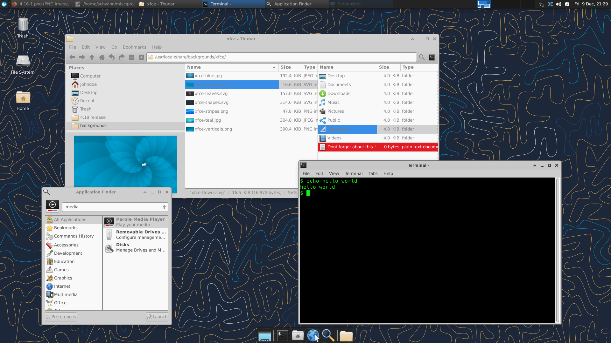

# Jag  (Niclas Stenberg)

## Bakgrund

- TeknD i hållfasthetslära
- Kört Linux sedan 1900-talet
    - först lite, sedan 2002 fullt ut
- 14år på forskningsinstitut
    - beräkningsteknik (FEM, stat, etc.)
    - Hade hand om beräkningsservrarna
    - Typ allt produktionsdigitaliseringsrelaterat
- Äger nu Örestad-Linux AB

# Lite om vad vi gör på Örestad-Linux AB

**Helt Linux-orienterat!**

- **Hosting**
    - Har en del VPS:er
    - Kubernetes-kluster
- **Nextcloud**
    - Har nextcloud servrar för våra kunder
- **Support**
    - En del kontor har egna servrar
    - Kontorsstuff ... problem som dyker upp: typ skrivare, AD (såklart)
- **Konsulting**
    - Sätta upp servrar
    - Sätta upp kluster
    - Projektledning, Allmänt stöd, etc.

# Programmering vs. drift.

Det är en flytande gräns \ldots Men som jag ser det:

## Programmering

Se till att det finns applikationer som är säkra och fungerar ihop med
andra applikationer.

## Drift

Se till att det finns en säker och fungerande grund för
applikationerna - **hela tiden!**

Kan innebära en hel del programmering ändå :)

# Först, lite om varför GNU/Linux körs på typ alla servrar

**GNU/Linux är:**

\bco

\co

- **GNU + Linux**
	- **GNU project** står för verktygen
	- **Linux** är kärnan
- **fritt licensierat (GPL)**
    - Låg kostnad
    - Möjligt att ändra efter eget huvud
    - Tillgängligt
- **Bygger på att folk hjälper varandra**
    - Enkelt få hjälp

\co

- **GUI-fritt (om man vill)**
    - liten installation
    - snabbt
    - skriptvänligt
- **enkelt**
    - Utvecklat av användare $\rightarrow$ användarvänligt
- **Väldigt stort ekosystem!**
    - massa applikationer!!
- **Centralt repository**
    - Enkel installation

\eco

# GNU/Linux : exempel Debian

\bco
\co

- **Repositories**
    - Debian har ~172000 paket
    - Kan lägga till egna repon
    - Öppet format på paketen
    - Alla paket hanteras på ett sätt
        - **dpkg**, **apt** och **apt-get**
- **Hårdvara**
    - funkar på nästan allt!

\co

- **Säkerhet**
    - Debian, och andra distros, får snabbare säkerhetsuppdateringar
      än andra OS.
- **Long Time Support**
    - Kommer finnas länge!
    - Och efter det går det att supporta själv!

\eco

# Köra Linux direkt på HW, virtuell maskin eller kontainer. Vad är skillnaden?

- **Hårdvara**
    - Bundet till maskinen
    - Uppgradering av kapacitet är bökigt
    - Ny maskin $\rightarrow$ ny installation

- **Virtuella maskiner** (en installation i en fil)
    - Bundet till den virtuella maskinen (som är en fil!)
    - Uppgradering av kapacitet är en editering av konf-fil
    - Ny maskin $\rightarrow$ copy-paste av VM
    - dock: Hos VPS-leverantör ofta nyinstallation

- **Kontainer** - oftast *Docker* (En väldefinierad paketering)
    - Bundet till Containern
    - Uppgradering av kapacitet är en editering av konf-fil
    - Ny maskin $\rightarrow$ starta om kontainer-conf på ny maskin
    - Går att använda i kluster

# Kort om Linux struktur, mest som påminnelse

# Kort om Linux struktur, mest som påminnelse

\scriptsize

| root-katalog | Användning                              |
|--------------|-----------------------------------------|
| /etc         | configurationsfilerna                   |
| /home        | users hem-katalog                       |
| /var         | filer som ändras (bla loggar, db, etc.) |
| /usr         | programmen med stödfiler                |
| /opt         | Hem för programpaket (externa)          |
| /srv         | Används ofta för serverns filer         |
| /dev         | "devices"                               |
| /proc        | "processes"                             |
| /tmp         | temp-katalog                            |
| /root        | roots hem katalog                       |

# Lite om rättigheter

- **root** är omnipotent
- **users** får tilldelade rättigheter
  - user : grupp : alla
- och det går att sätta extra rättigheter (ACL)

\tiny

    -rw-r--r-- 1 niclas niclas 6.9K  3 Nov 16.15 LICENSE
    -rw-r--r-- 1 niclas niclas 2.6K  3 Nov 16.15 anteckningar.org
    -rw-r--r-- 1 niclas niclas  85K  3 Nov 16.15 cliCheatSheet.pdf
    -rw-r--r-- 1 niclas niclas 126K  3 Nov 16.15 bunsenlabs.jpg
    -rw-r--r-- 1 niclas niclas 1.1M  3 Nov 16.15 gnome.png
    -rw-r--r-- 1 niclas niclas 268K  3 Nov 16.15 linuxfs.png
    -rw-r--r-- 1 niclas niclas 285K  3 Nov 16.15 kde.jpeg
    -rw-r--r-- 1 niclas niclas 190K  3 Nov 16.15 losenord.jpg
    -rw-r--r-- 1 niclas niclas 164K  3 Nov 16.15 systemBeskrivning.pdf
    -rwxrw-r-- 1 niclas niclas 564K  3 Nov 16.15 xfce.png
    -rw-r--r-- 1 niclas niclas   87  3 Nov 16.15 README.md
    -rw-r--r-- 1 niclas niclas 3.2M  3 Nov 16.21 pres.md.slides.pdf
    -rw-r--r-- 1 niclas niclas 9.7K  3 Nov 16.28 pres.md

\normalsize

# Lite om distrubitionerna

##

Linux kärna + GNU verktyg + andra prog + paketering $\rightarrow$ **distro**

##

Distrubitionen sker i form av definierade paket. En funktion = ett paket.

##

Olika **distro** använder olika paketformat.
\bco

\co

- **rpm**-paketering
    - Redhat
    - CentOS $\rightarrow$ Alma, Rocky ...
    - Fedora
    - OpenSuse, Suse Enterprize

\co

- **deb** -paketering
    - Debian
    - Ubuntu + andra (många \ldots)

- **annan** paketering
    - slackware
    - Arch
    - NixOS, Gentoo, ...

\eco

# Distrolänkar:

[https://en.wikipedia.org/wiki/Comparison_of_Linux_distributions](https://en.wikipedia.org/wiki/Comparison_of_Linux_distributions)

[https://distrowatch.com/](https://distrowatch.com/)

##

Osäker men nyfiken: det spelar inte så stor roll :) ubuntu, fedora,
debian, \ldots

# Köra Linux direkt på HW

**Vilka val:**

- Hårdvara såklart!
    - Balansera investering mot behovet
    - Framtidssäkring kan bli dyrt

- Distro:
    - passar hårdvaran?
    - deb eller rpm?

**Jobb:**

- Bestämma partitioner
    - Utrymme kvar för annat?
- Installera
- Säkra både fysisk som virtuell åtkomst

# Köra Linux på virtuell maskin

**Finns två möjligheter:**

- Virtuellt på egen maskin
- Virtuellt hos en leverantör

**Inte så många val!**

- Starta en maskin du tror räcker för stunden
- Räcker det inte $\rightarrow$ skala upp
- Maskin & Lagring
- Distro

**Jobb:**

- Installera
- Säkra virtuell åtkomst

# Köra Linux som kontainrar

Kontainrar: i.e. docker i denna pres.

*Docker är en sluten produkt, men det finns fria alternativ som används mer och mer.*

**Behöver**

- En maskin som kör en docker-server
    - En linux-maskin, HW eller VM.
- Eller ett kluster

**Val:**

- vilken image eller bygg egen

**Kontainrar funkar bra i kluster**

- Docker swarm
- Kubernetes

# Några ord om leverantörer av Virtuella Maskiner

**Egen server** är oftast en bas för att köra VM:er på.

Det finns också ett flertal leverantörer av VPS:er (Virtual Private
Server)

Värt att tänka på:

- **Lokalisering:** Sverige, Europa, Amerikat, Kina, \ldots
- **Interna, externa**-nätverk : interna viktigt vid kluster
- **Färdiguppsatta VM:er**
- **Maskin** & **Lagring**
- **Kostnad** - kolla runt lite
- **Fundera på vad som är viktigt!**

# Hur att kommunicera

En server (web eller annat) sitter ofta någon annanstans. Det är
sällan man jobbar direkt med tangentbordet kopplat till servern.

Kommunikationen sker via nätverket.

$\rightarrow$ **ssh**  secure shell

öppnar en krypterad tunnel till servern. Exempel:

    ssh -p 222 orestad@112.67.45.23

- **ssh**: kommando
- **-p 222**: försöker öppna på port 222
- **orestad**: användaren på servern
- **112.67.45.23**: ip-adressen till servern

Om användare orestad finns på 112.67.45.23 och får logga in så öppnas en tunnel.

# Att hantera vid igångsättning av server  1/2

- **Distro** - jag tycker om Debian
- **Uppdatera**
    - Direkt
    - Automatiska uppdateringar (unattended-upgrades)
- **Installera bara det nödvändigaste**
    - Behövs gcc, eller andra kompilatorer?
- **Säkra ssh**
    - Maffiga lösenord, eller endast nyckel!
    - inga onödiga användare
	- fail2ban  (blockera de _onda_ som försöker)
- **Håll koll på portarna utåt**
    - iptables styr de öppna portarna
    - iptables-persistent ser till att iptables finns kvar vid omstart

# Att hantera vid igångsättning av server 2/2

- **Kolla tiden NTP**
- **Kolla vilka processerservicar som körs**
    - \texttt{systemctl list-units -t service}
    - Ta bort de som ni inte vill ha
- **Back-up??**
    - till var?
        - leverantörsbackup eller annan server
    - borg backup

# ssh login

\bco
\co

**Maffigt Lösenord**

\co

**Endast nyckel**

\scriptsize

På server: i /etc/ssh/sshd_config

    PasswordAuthentication no

Lokalt generera nyckel och sedan kopiera till server

    ssh-keygen -t ed25519
    ssh-copy-id root@10.20.30.41

eller copy paste pub-nyckeln in i serverns

    ~/.ssh/authorized_keys

\eco

\normalsize

# iptables

Det finns andra brandväggar (typ ufw) , men de configurerar ofta bara
iptables så..
Dock så finns **nftables** som ett alternativ. Ej så vanlig än.

\scriptsize

\bco
\co

**iptables comm:**

    iptables -S
    iptables -L

lägga till regel:

    iptables -A INPUT -p tcp --dport 22 -j ACCEPT

\co

**sample /etc/iptables/rules.v4**

    *filter
    :INPUT DROP [0:0]
    :FORWARD DROP [0:0]
    :OUTPUT ACCEPT [0:0]
    -A INPUT -i lo -j ACCEPT
    -A INPUT -m state \
        --state RELATED,ESTABLISHED -j ACCEPT
    -A INPUT -p tcp --dport 22 -j ACCEPT
    -A INPUT -p tcp --dport 80 -j ACCEPT
    -A INPUT -p tcp --dport 443 -j ACCEPT
    COMMIT

\eco

# Att tänka på vid docker-installationer

- **Docker** kommunicerar via portar
  - lägger dit egna iptables
- **Docker swarm** kommunicerar i definierade nätverk
    - Docker rekommenderar att docker swarm används i produktion
      istället för docker-compose
- **Non-root docker** - ett val!
    - Sätta upp så att en användare kan köra docker. Behövs det?

# allmän serverhantering

- **intrång**
    - oftast (enligt min erfarenhet) via applikationer
    - shit happens!
    - $\rightarrow$ damage control!
- **intrångsförsök**
    - fail2ban (ssh) finns andra alternativ
    - kolla loggarna!!
- **full disk**
    - ofta loggarna som blir stora
- **övervakning**

# Viktigt

**cd /var/log**

dina vänner heter:

- ls, cd
- grep
- cat
- tail
- history
- screen/tmux
- ip
- find
- man
- sedan så finns det andra verktyg dock...

# Desktop linux

Samma distro som för servrar.

Lägger till Desktopmiljö:

- Gnome
- KDE
- XFCE
- cinnamon, openbox, fluxbox, Mate, Enlightenment, ...

# pics

\bco

\co

\co

\eco

# pics

\bco

\co

\co

\eco

# bara att ladda ner till en USB och prova

- [debian.org](https://debian.org)
- [ubuntu.com](https://ubuntu.com)
- [fedoraproject.org](https://www.fedoraproject.org)
- [linuxmint.com](https://linuxmint.com)
- [opensuse.org](https://www.opensuse.org/)

# Länk till dokumenten

[https://github.com/Xnst/linux_OOAD](https://github.com/Xnst/linux_OOAD)

##
- pres.md.slides.pdf
- anteckningar.org
- cliCheatSheet.pdf
- systemBeskrivning.pdf
- _och_ hjälpfiler till att skapa pres

# Sätta upp en Linux-server som man ska köra något enkelt i t ex en Nginx och visa vad man praktiskt måste göra för att den ska köra "säkert".
